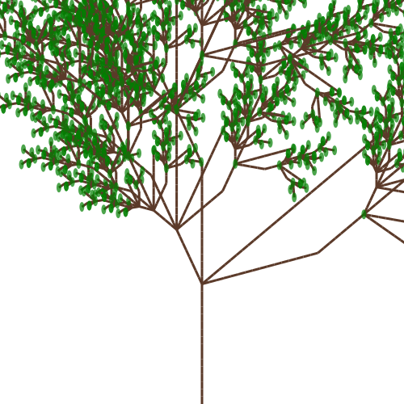
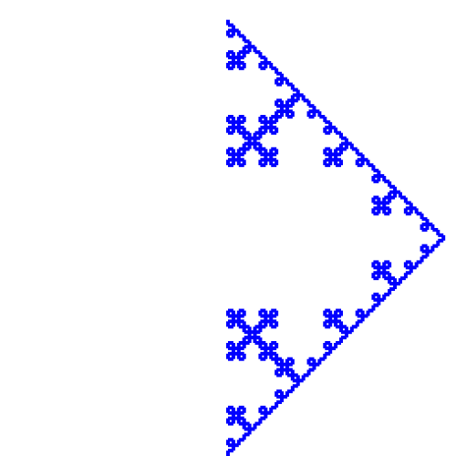

# L-System-Artwork-Generator

## Overview
This project implements a configurable **L-System (Lindenmayer System)** generator in Python that produces generative plant and fractal structures. By varying axioms, rules, and rendering parameters, the system creates diverse forms ranging from organic plants to geometric patterns.


## How to Run
1. **Create the Conda environment**
```bash
   conda create --name iat460 python=3.11
```
2. **Activate conda environment**
```bash
   conda activate iat460
```
3. **Install packages**
```bash
    pip install -r requirements.txt
```
4. **Run main.py**
```bash
python main.py
```

## Results
### Example 1
**Output:** <br>
**Generation Method:**  
```bash
 {
    "axiom": "X",
    "rules": [
        ("F", "FF"),
        ("X", "F+[-F-XF-X][+FF][--XF[+X]][++F-X]"),
    ],
},
```
- Recursive rules emphasizing multi-branch growth  
- Generated with branching angle = 25°, branch length falloff = 0.65, and iterations = 5
- Leaves added at branch termination points  

This example demonstrates an organic plant structure with asymmetric branching.

### Example 2
**Output:** <br>  
**Generation Method:**  
```bash
{
    "axiom": "FX",
    "rules": [
        ("F", "FF+[+F-F-F]-[-F+F+F]"),
    ],
},
```
- Rule expansion focuses repeated forward motion  
- Generated with branching angle = 20°, branch length falloff = 0.7, and iterations = 5

This configuration produces a fuller, bush-like appearance with balanced symmetry.

### Example 3
**Output:** <br>   
**Generation Method:**  
```bash
{
    "axiom": "X",
    "rules": [
        ("F", "FX[FX[+XF]]"),
        ("X", "FF[+XZ++X-F[+ZX]][-X++F-X]"),
        ("Z", "[+F-X-F][++ZX]"),
    ],
},
```
- Uses multiple non-terminal symbols (`X`, `Z`)  
- Generated with branching angle = 60°, branch length falloff = 0.6, and iterations = 5

The result is a fractal-like structure with irregular branching patterns.

### Example 4
**Output:** <br>  
**Generation Method:**  
```bash
{
    "axiom": "F",
    "rules": [
        ("F", "F+F-F-F+F")
    ],
},
```
- Koch curve 
- Generated with branching angle = 90°, branch length falloff = 0.9, and iterations = 4

This example produces a structured Koch curve form.

### Example 5
**Output:** <br> 
**Generation Method:**  
```bash
{
    "axiom": "X",
    "rules": [
        ("F", "FFFX[FFX[+FXX]]"),
        ("X", "XFF[+FFFFX-X-F-X][F+X+FX]")
    ]
}
```
- Generated with branching angle = 130°, branch length falloff = 0.6, and iterations = 5 

This example is a visual experiment using L-systems that explores abstraction, not organic realism.